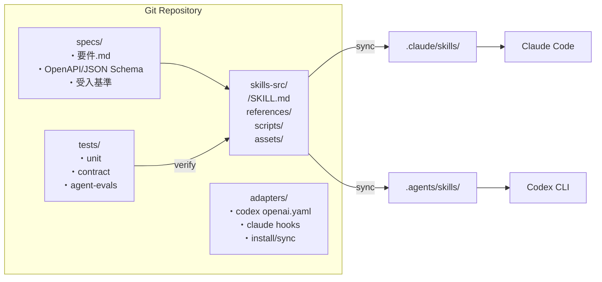
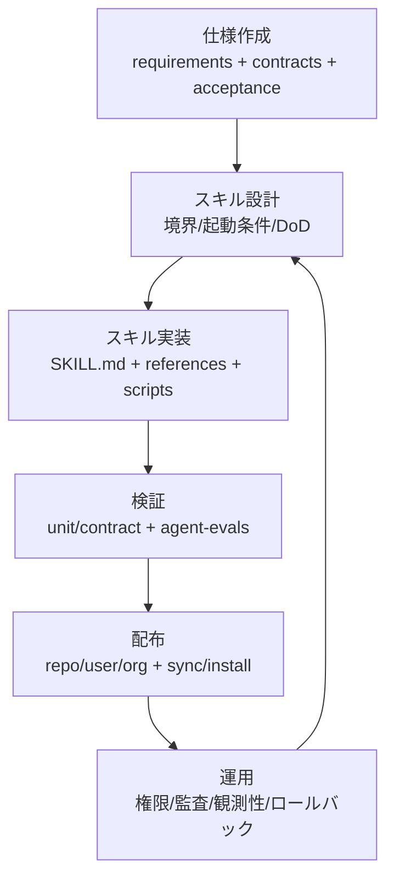
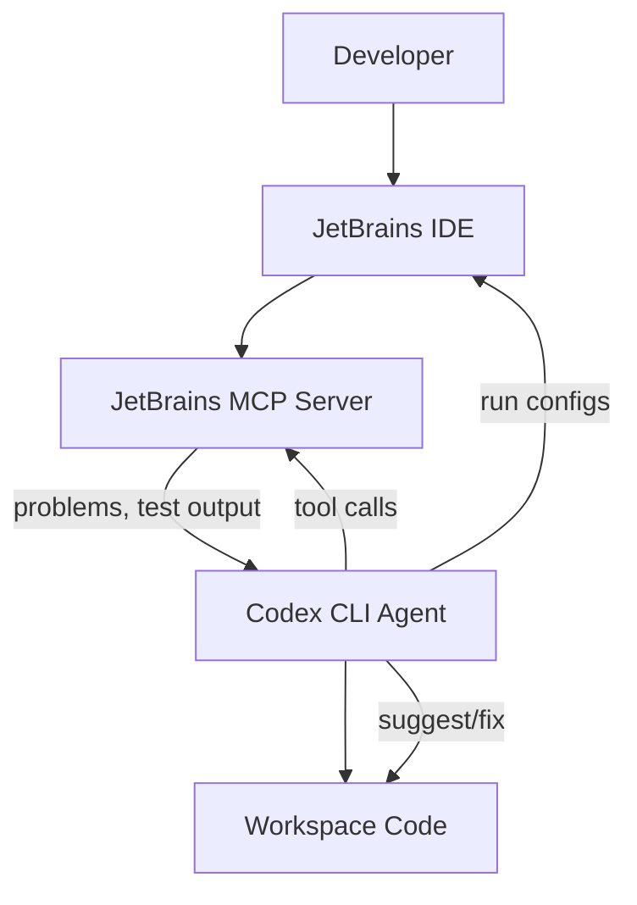

# AIを使った仕様駆動開発とAgent Skills時代の最新ベストプラクティス

## エグゼクティブサマリ

仕様駆動開発（Specification-Driven Development; SDD）にAI（LLM/Agent）を組み合わせる開発様式は、2025年後半〜2026年にかけて「**Agent Skills（SKILL.md）という可搬な“手続き・知識パッケージ”を中核に据える**」方向へ急速に収束しつつあります。Agent Skillsは、起動時にメタデータだけを読み込み、必要時にのみ本文・参照・スクリプトを段階的にロードする“progressive disclosure”を前提にしており、巨大なAGENTS.md/CLAUDE.mdに全指示を詰め込む運用が抱えていたコンテキスト劣化・保守性低下を構造的に緩和します。citeturn19view1turn9view0turn8view0

本調査の結論は、Claude CodeとCodex CLIの両方で共通化したい場合、「**Agent Skillsオープン標準（agentskills.io）を“仕様資産の配布単位”にする**」のが現時点で最も合理的、という点です。すなわち、仕様（要件/契約/テスト）→スキル設計→スキル実装（指示＋参照＋スクリプト）→評価（単体/契約/エージェントEvals）→配布（リポジトリ/個人/組織）→運用（権限・監査・観測性）を、すべて「スキル＝実行可能な仕様パッケージ」として揃える設計が、ツール差異を吸収します。citeturn19view1turn15view0turn14view0

“Agent Skills/スキル化の台頭”がもたらした最大の変化は、**プロンプト設計が「一回の依頼文」から「バージョン管理され、評価可能で、段階ロードされるSOP（標準手順書）」へ移行**した点です。OpenAI側も、スキルを「組織化されたプロンプト集合」と捉え、Evals（評価）で回帰を検出しながら改善する、というテスト駆動に近い運用パターンを公式に提示しています。citeturn15view0turn16view2turn9view0

一方で、スキル化は「万能薬」ではありません。ネットワークやシェル権限の付与はプロンプトインジェクション・機密漏えい・サプライチェーン混入リスクを増幅し得ます。Claude Code/Codex双方が、サンドボックス・承認フロー・許可リスト・監査を重視する設計を明確にしているため、SDD×Skillsは**最小権限・契約検証・観測可能性・ロールバック**を前提にプロセス化する必要があります。citeturn12view2turn22view0turn10search13

---

## 調査対象と優先ソース

本レポートは、（1）Claude Code公式ドキュメント、（2）Codex CLI公式ドキュメント、（3）Agent Skillsオープン標準、（4）近5年の主要学術論文、（5）業界ブログ/企業・OSS事例（日本語優先）を優先順位順に参照し、SDDを「仕様→実装→検証→運用」を貫く開発プロセスとして再定義した上で、両CLIに共通適用できる実装・運用のベストプラクティスに落とし込みました。citeturn8view0turn9view0turn19view1turn15view0turn20search5turn20search6

主要参照URL（一次ソース中心、抜粋）は以下です（本文でも随所で根拠として引用）。citeturn8view0turn9view0turn19view1turn22view0turn15view0

```text
Claude Code（公式）
https://code.claude.com/docs/ja/skills
https://code.claude.com/docs/ja/plugins-reference
https://code.claude.com/docs/ja/security
https://code.claude.com/docs/ja/checkpointing
https://code.claude.com/docs/ja/monitoring-usage
https://code.claude.com/docs/ja/data-usage
https://code.claude.com/docs/ja/mcp

Codex CLI（公式）
https://developers.openai.com/codex/cli/
https://developers.openai.com/codex/skills/
https://developers.openai.com/codex/security/
https://developers.openai.com/codex/config-reference/
https://developers.openai.com/codex/guides/agents-md/
https://developers.openai.com/codex/noninteractive/
https://developers.openai.com/codex/guides/agents-sdk/
https://developers.openai.com/blog/eval-skills/
https://developers.openai.com/blog/skills-shell-tips

Agent Skills（オープン標準）
https://agentskills.io/
https://agentskills.io/specification

Skillsカタログ/事例
https://github.com/openai/skills
https://github.com/railwayapp/railway-skills
https://docs.railway.com/ai/agent-skills
https://developers.openai.com/blog/skyscanner-codex-jetbrains-mcp
https://docs.github.com/en/enterprise-cloud@latest/copilot/concepts/agents/about-agent-skills

主要論文（例）
https://arxiv.org/pdf/2310.06770  (SWE-bench)
https://arxiv.org/pdf/2405.15793  (SWE-agent)
https://arxiv.org/pdf/2210.03629  (ReAct)
https://arxiv.org/pdf/2302.04761  (Toolformer)
https://arxiv.org/pdf/2305.16291  (Voyager)
https://arxiv.org/abs/2409.09030  (Agents in SE survey)
```

---

## 定義と範囲

本レポートでのSDDは、「**仕様（要求・制約・契約・受入条件）を主成果物として先に固定し、その仕様からテストと検証手続きを導出し、実装は“仕様を満たすこと”に従属させる**」開発様式として定義します。これは契約（Design by Contract/Contract-Driven Development）に基づきテストを導出する考え方と整合し、仕様を“検証可能”な形で保持する点が重要です。citeturn21search11turn21search19

AI（LLM/Agent/Skill）を組み合わせたワークフローの範囲は、次を含みます。  
1) **仕様の構造化**（ユーザーストーリー、制約、非機能要件、契約、API定義、テスト観点の明文化）  
2) **Skill化**（SKILL.md＋参照＋スクリプトに仕様・手順・テンプレートをパッケージングし、必要時のみロードする設計）citeturn19view1turn9view0turn8view0  
3) **ツール連携**（CLI、サンドボックス、承認フロー、MCP、IDE/CI連携）citeturn7view0turn22view0turn17view0  
4) **評価と回帰管理**（エージェント実行のトレース、成果物、手順順守をEvals/テストでスコアリング）citeturn15view0turn22view0  
5) **運用**（最小権限、監査ログ、観測性、ロールバック、データ保持/学習利用ポリシー確認）citeturn12view2turn13view2turn14view0turn22view0  

逆に、本レポートの範囲外（深掘りしない）として、(a) モデルの追加学習（SFT/RFT/微調整）そのものの手順詳細、(b) 単一ベンダーに強く依存するGUI固有操作、(c) 組織固有の法務判断（個別契約解釈）を置きます。ただし、法的・倫理的リスクの論点は列挙します。citeturn13view1turn10search13turn22view0

---

## 技術要素の要点整理

Agent Skills時代の技術要素は「**仕様→手続き→実行→検証→監査**」を一本の鎖として設計できるかに集約されます。以下では、要求された要素を“SDDの観点”で整理します。

まず、Agent Skills自体は「SKILL.md（YAML frontmatter＋本文）を最低要件とするディレクトリ」であり、`name/description`が必須、`scripts/ references/ assets/`などの任意ディレクトリを持つ、という構造です。citeturn19view1turn9view0 `name`には長さ・文字種・ディレクトリ一致などの制約があり、これが**配布互換性**を担保する“最低限の契約”になります。citeturn19view1

次に、Claude CodeとCodexはどちらも「progressive disclosure」を重視し、**起動時はメタデータのみ→必要時にSKILL.md本文→必要時に参照/スクリプト**という段階ロードでコンテキストを節約します。citeturn9view0turn19view1turn8view0 これはSDDにおいて極めて重要で、仕様を「いつも全部読む巨大ドキュメント」から、「必要時だけ読む“仕様モジュール”」へ分割する設計を促します。

プロンプト設計（スキル設計）のベストプラクティスは、**descriptionを“ルーティングルール”として扱う**ことです。Codex公式は、暗黙起動はdescriptionのマッチングに依存するため、スコープと境界が明確なdescriptionを書くべき、と明示しています。citeturn9view0turn15view0 したがって、SDDの観点では「仕様の境界条件（適用/非適用）」をdescriptionと本文の両方に書き、さらに**否定例（このスキルは使わないケース）をEvalプロンプトに入れる**のが実務的に効きます。citeturn15view0turn16view2

ツール連携（CLI/API）については、両者ともサンドボックスと承認フローを軸にしています。Claude Codeは「デフォルト読み取り専用→編集/実行は明示許可」という権限モデルを置き、危険コマンド（例：`curl`/`wget`）のデフォルトブロックなどを含む多層の保護を説明しています。citeturn12view0turn12view2 Codexも同様に、sandbox mode（技術的にできること）とapproval policy（承認が必要なタイミング）の二層で制御し、`--sandbox`と`--ask-for-approval`の組合せを推奨例として提示しています。citeturn22view0 したがって共通ベストプラクティスは、「**スキルごとに必要権限を最小化し、暗黙起動を抑制し、実行後に検証を必須化**」です。citeturn9view0turn8view0turn22view0

テスト自動化と契約検証は、Agent Skillsの台頭で「**エージェントの“成果物”だけでなく“手順順守”もテスト対象**」になりました。OpenAI公式は、スキル改善を“雰囲気”で判断せず、(a) 成果（Outcome）、(b) 手順（Process；スキルが起動したか、期待コマンドが走ったか）、(c) 形式（Style）、(d) 効率（不要実行/トークン）を小さなチェック集合でスコアリングする、という評価設計を提示しています。citeturn15view0 これはSDDそのものであり、「仕様＝成功条件の可観測化」を意味します。

観測性は、Claude CodeがOpenTelemetry（OTel）でメトリクスとイベントをエクスポートし、環境変数でOTLP/Prometheus等に送れることを明確にしています。citeturn14view0 Codexもセキュリティ文脈で、OTelによる監査・調査目的のopt-in監視を述べています。citeturn22view0 このため、共通ベストプラクティスは「**スキル単位で実行ID（セッションID等）を相関キーにし、実行ログ・成果物・Git差分・テスト結果をトレース可能にする**」ことです。citeturn8view0turn14view0turn15view0

最後にエラー回復戦略は、「エージェントは失敗する」ことを前提に、ロールバック機構と実行の粒度設計が要です。Claude Codeは編集前状態を自動キャプチャして巻き戻せるcheckpointingを説明し、Bashコマンド等は追跡されないなどの限界も明示します。citeturn11search1 Codexは、ブランチ運用・パッチベース・小さなコミットで巻き戻しを容易にすることを推奨し、バージョン管理を安全装置として位置づけています。citeturn22view0 よって共通方針は「**スキルは“1回の起動で不可逆操作を完了させない”**」「**必ず“定義されたDoneチェック”を通す**」「**失敗時の戻し方をSKILL.mdに明記する**」です。citeturn15view0turn11search1turn19view1

---

## Claude CodeとCodex CLIで共通に使える実装パターン

共通化の要点は、(A) スキルのフォーマットをAgent Skills標準に合わせる、(B) 仕様資産（契約・テスト・テンプレ）をスキル参照として同梱する、(C) ツール差（権限・暗黙起動・配布先・MCP/フック）を“アダプタ層”で吸収する、の3点です。citeturn19view1turn8view0turn9view0turn7view0

### 共通アーキテクチャの基本形

以下は、リポジトリ内でスキルを“単一ソース”として管理し、Claude/Codex双方へ配布（コピー/シンボリックリンク）する設計例です。Codexはリポジトリ内の`.agents/skills`を探索してスキルを読む一方、Claude Codeは`.claude/skills`やプラグイン配下など複数のスコープを持ちます。citeturn9view0turn8view0turn7view0



この構造の狙いは、「仕様」と「手続き（スキル）」と「検証（テスト/Evals）」を分離しつつ、スキルが仕様参照を“必要時だけ読む”ように設計することです。progressive disclosureに合わせ、SKILL.mdは薄く・参照ファイルに厚く、が推奨されます。citeturn19view1turn8view0

### インターフェース仕様とデータフォーマット

SDD×Skillsを両CLIで共通化するには、スキルのI/Oを「人間向け文章」だけにせず、**機械可読な成果物（JSON/YAML）を必ず生成**させる設計が有効です。OpenAIはスキル評価で`codex exec --json`によるJSONLトレースを推奨し、エージェントの実行過程をプログラムで検査できる状態を作ります。citeturn15view0turn10search3 Claude側も、セッションID置換やフック/ツール結果イベントなど、外部で相関・監査するための仕組みを提供します。citeturn8view0turn14view0turn7view0

推奨フォーマット（共通）：
- **成果物**：`artifacts/<skill>/<timestamp_or_session>/result.json`（スキーマ固定）  
- **契約**：`references/contract.schema.json`（JSON Schema）  
- **エラー**：`result.json`内で`errors[]`を標準化（後述テンプレ参照）  
- **バージョニング**：スキルのfrontmatter `metadata.version`＋Gitタグの二重管理（標準の`metadata`は任意キーを許容）citeturn19view1  

### エラーハンドリングとバージョニング戦略

エージェント作業は「途中で止まる」「環境差で失敗する」「誤って広範囲に変更する」事象が現実に起こります。研究でも、ソフトウェア工学タスクのベンチマーク（SWE-bench）やエージェント実装（SWE-agent）が、実行環境やインターフェース設計（ACI）に性能が強く依存することを示しています。citeturn20search5turn20search6turn20search38  
よって、共通の実装パターンとしては次が“必須”です。

- **失敗を前提に、再実行可能なステップへ分割**（idempotentなスクリプト、スキップ条件、途中成果物の保存）citeturn19view1turn15view0  
- **ロールバック可能性を常に確保**（Claude: checkpointingで編集巻き戻し、Codex: ブランチ/小コミット/パッチ運用）citeturn11search1turn22view0  
- **互換性差を吸収する“アダプタ設定”の分離**（ツール固有設定をskill本体から切り離す）citeturn9view0turn8view0turn7view0  

### Claude CodeとCodex CLIの比較表

| 観点 | Claude Code | Codex CLI | 相互運用上の示唆 |
|---|---|---|---|
| Skillsの標準 | Agent Skillsオープン標準に準拠し、追加機能（呼び出し制御、サブエージェント実行、動的コンテキスト注入等）を拡張として提供 citeturn8view0 | Agent Skillsオープン標準に準拠。progressive disclosureでメタデータ→本文→リソースを段階ロード citeturn9view0turn19view1 | **SKILL.mdは標準準拠を軸に**。追加機能はアダプタ層で分離し、壊れやすい拡張は最小化 |
| 配布/スコープ | 個人（`~/.claude/skills`）、プロジェクト（`.claude/skills`）、プラグイン（`<plugin>/skills`）など複数 citeturn8view0turn7view0 | リポジトリ/ユーザー/管理者/システムの複数スコープ。repoは`.agents/skills`を探索 citeturn9view0turn10search14 | 単一ソースを`skills-src/`に置き、`.claude/skills`と`.agents/skills`へ同期する設計が現実的 |
| 自動化 | フック（PreToolUse/PostToolUseFailure等）でイベント駆動の自動化が可能 citeturn7view0turn11search0 | `codex exec`でCI/スクリプト実行。`--json`等で構造化出力＆解析を前提化 citeturn10search3turn15view0 | 自動化は「Claude=イベント駆動」「Codex=バッチ駆動」に寄る。共通の“検証スクリプト”をskills/scriptsに持たせると統合しやすい |
| 権限/安全 | 権限ベース設計、サンドボックスbash、ホワイトリスト、危険コマンドのデフォルトブロック等を明示 citeturn12view0turn12view2 | sandbox mode＋approval policyの二層。OSレベルサンドボックス実装や`--yolo`注意喚起 citeturn22view0 | 「スキル＝実行単位」ごとに最小権限と暗黙起動抑制を設計。ネットワークは原則denyで段階解放 citeturn10search13turn12view2turn22view0 |
| 観測性 | OpenTelemetryのメトリクス/イベントを詳細に提供 citeturn14view0 | OTelによるopt-in監視を言及 citeturn22view0 | 共通で「スキル実行ID→成果物→Git差分→テスト結果」を紐付ける設計を採用 |
| 追加拡張 | プラグインにSkills/Agents/Hooks/MCP/LSPなど複合コンポーネント citeturn7view0 | MCPサーバとしてCodexを外部から呼び出し、Agents SDK等でオーケストレーション citeturn10search7turn9view1 | 高度化するほどMCPが共通インターフェースになる。IDE/CI/外部サービスはMCPで接続し、スキルは“手順と契約”に集中 |

---

## 仕様からスキルへ: ワークフローとアウトプット例

ここでは、SDDを「スキル設計・実装・テスト・デプロイ・運用」まで通した、具体ステップ（成果物テンプレ付き）として提示します。基礎思想は、OpenAIが示す「成功条件→スキル→手動実行で前提露出→自動化（exec/trace）→Evals」という流れを、仕様駆動へ拡張することです。citeturn15view0turn16view2



### ステップごとのアウトプット例

**仕様（specs/）**：要件を“検証可能”にするため、最低限以下を揃えます。
- `specs/requirements.md`：目的、非目的、前提、ユースケース、制約（性能/セキュリティ）  
- `specs/api/openapi.yaml`：APIを作るなら契約（契約駆動）  
- `specs/contracts/*.schema.json`：入力/出力のJSON Schema  
- `specs/acceptance.md`：受入条件（Given/When/Thenでも可）  

**スキル（skills-src/<name>/）**：SKILL.mdは薄く、参照に厚くが原則です（500行以下推奨）。citeturn19view1turn8view0

```markdown
---
name: spec-implementer
description: Implement features strictly from specs/requirements.md and specs/contracts. Use when asked to implement/change behavior based on written specifications. Do NOT use for ad-hoc coding without specs.
license: Proprietary
metadata:
  owner: platform-team
  version: "0.1.0"
  spec_root: "specs/"
allowed-tools: Read Grep Glob Bash(git:*) Bash(node:*) Bash(pytest:*)
---

# Purpose
You turn written specifications into code changes with strong verification.

# Inputs
- specs/requirements.md
- specs/contracts/*.schema.json
- (optional) specs/api/openapi.yaml

# Outputs (MUST)
- artifacts/spec-implementer/result.json
- code changes + tests
- a short CHANGELOG entry (docs/changes.md)

# Non-goals
- Do not introduce new behavior not present in specs.
- Do not change public contracts unless explicitly requested.

# Procedure
1) Read specs and extract: invariants, preconditions, postconditions.
2) Draft an implementation plan aligned to contracts.
3) Implement smallest coherent slice.
4) Run verification:
   - unit tests
   - contract tests (schema validation)
   - (if available) integration tests
5) Produce artifacts/spec-implementer/result.json with:
   - summary
   - filesChanged
   - testsRun
   - contractCompliance
   - remainingRisks
6) If any failure occurs:
   - rollback strategy: git checkout -- <files> OR revert commit
   - record the failure in result.json errors[]
```

この“手順の明文化”は、ReAct（Reasoning+Acting）やToolformer（ツール使用の自己学習）など、近年のエージェント研究が示してきた「外部ツールと反復フィードバックが信頼性を上げる」方向性と整合します。citeturn20search19turn21search16turn21search5

**成果物スキーマ（例: JSON Schema）**：スキルの結果を機械検査可能にします。

```json
{
  "$id": "https://example.com/schemas/skill-result.schema.json",
  "type": "object",
  "required": ["skill", "version", "status", "filesChanged", "testsRun", "errors"],
  "properties": {
    "skill": { "type": "string" },
    "version": { "type": "string" },
    "status": { "type": "string", "enum": ["success", "partial", "failed"] },
    "summary": { "type": "string" },
    "filesChanged": { "type": "array", "items": { "type": "string" } },
    "testsRun": {
      "type": "array",
      "items": {
        "type": "object",
        "required": ["command", "exitCode"],
        "properties": {
          "command": { "type": "string" },
          "exitCode": { "type": "integer" },
          "notes": { "type": "string" }
        }
      }
    },
    "contractCompliance": {
      "type": "object",
      "properties": {
        "schemasValidated": { "type": "array", "items": { "type": "string" } },
        "violations": { "type": "array", "items": { "type": "string" } }
      }
    },
    "errors": {
      "type": "array",
      "items": {
        "type": "object",
        "required": ["code", "message"],
        "properties": {
          "code": { "type": "string" },
          "message": { "type": "string" },
          "hint": { "type": "string" },
          "retryable": { "type": "boolean" }
        }
      }
    }
  }
}
```

**Evals/自動評価（Codex寄りだが共通化可能）**：OpenAI公式は、`codex exec --json`のJSONLイベントを解析して「npm installしたか」等の手順をdeterministicに検査する例を提示しています。citeturn15view0 これを一般化し、「スキルが規定するDoDチェック」「実行したコマンド」「成果物ファイル生成」「スキル誤起動（false positive）」をCSVプロンプト集合で回帰テスト化します。citeturn15view0turn9view0

### Claude Code向けスキル化依頼テンプレート

以下は、**Claude Codeに“スキル化（SKILL.md＋参照＋スクリプト）を依頼する”ための実務テンプレ**です。Claude側はスキルが`/skill-name`で呼べること、引数を`$ARGUMENTS`で受けられること、さらに`allowed-tools`等でツール権限を制限できることを公式に示しています。citeturn8view0turn19view1

```markdown
# スキル化依頼: <skill-name>

## 目的
- 何を仕様として固定し、何を自動化したいか（SDDの観点で簡潔に）
- 成果物（生成物）が「検証可能」になる形を明記（result.json 等）

## 入力仕様（必須）
- 対象リポジトリ/ディレクトリ:
- 参照すべき仕様:
  - specs/requirements.md: （パス）
  - specs/contracts/*.schema.json: （パス）
  - （任意）specs/api/openapi.yaml: （パス）
- 実行環境前提:
  - OS/コンテナ: 未指定（クラウド非依存）
  - 言語: TypeScript/Python中心（必要なら明記）
  - 必須コマンド: node, npm/pnpm, pytest など

## 期待出力（必須）
- artifacts/<skill-name>/result.json（スキーマ: references/skill-result.schema.json に準拠）
- 変更差分（コード/設定/テスト）
- 実行したテストコマンド一覧（result.jsonにも残す）
- 既知の残リスクと未対応項目（result.json + 文章）

## エッジケース（必須）
- 仕様が曖昧/矛盾している場合の扱い（例: 実装を止めて質問リストを result.json に出す）
- テストが存在しない/壊れている場合（最小の契約テストを追加する等）
- ネットワークが不要な設計を優先（必要なら allowlist 条件を明示）
- 大規模差分になりそうな場合（分割PR/分割コミット方針、ロールバック手順）

## テストケース（必須）
- Unit:
- Contract（schema validation）:
- Integration（可能なら）:
- Negative（誤起動/誤適用を防ぐ）:
  - この入力ではスキルを使わない、の例を複数

## API契約（契約駆動）要件（該当時）
- OpenAPI/JSON Schema の更新ルール（破壊的変更禁止、バージョニング戦略）
- エラーフォーマット統一（例: { error: { code, message, details } }）

## セキュリティ要件（必須）
- 最小権限（allowed-tools を限定）
- シークレット取り扱い（ログに出さない、ファイルに書かない）
- 外部取得（web/ネットワーク）が必要なら:
  - 許可ドメイン
  - HTTPメソッド
  - 認証方法（環境変数/secret manager）
- 監査ログに残すべき情報（セッションID、成果物パス、実行コマンド）

## 実装指示（SKILL.md 構成）
- SKILL.md は 500行以下、詳細は references/ へ退避
- references/ に:
  - requirements 要約（機械が読みやすい箇条書き版）
  - contract.schema.json
  - examples/
- scripts/ に:
  - validate_contracts.(py|ts)
  - run_tests.(sh)
  - generate_result_json.(py|ts)

## 完了条件（Definition of Done）
- result.json がスキーマ検証に通る
- 指定テストがすべて pass
- 仕様の範囲外の変更がない（差分レビュー観点も明記）
```

---

## Agent Skills活用事例分析

ここでは、Agent Skillsを“仕様資産の担体”として機能させている事例を3件取り上げ、SDD観点で分析します（いずれも公開一次情報に基づく）。citeturn17view0turn18search5turn16view2

### 事例: entity["company","Skyscanner","travel search company"] × entity["company","JetBrains","ide vendor"] MCP連携によるテスト・デバッグ高速化

Skyscannerの事例は、「Codex CLIをJetBrains IDEのMCPサーバに接続し、IDEが持つ検査・実行機能をツール化してエージェントに渡す」ことで、コンパイルエラー検出やテスト実行のフィードバックループを短縮したものです。具体的には、IDE側の`get_file_problems`（エラー/警告の位置付き返却）や`execute run configurations`（テスト/リンタ等の既存設定実行）をCodexが呼び出し、修正→検査→修正の反復を自動化しやすくした、と説明されています。citeturn17view0



SDDの観点では、IDE検査結果が「**契約違反（コンパイル不能）を即時に観測可能にする**」点が核心で、エージェントが“推測”で進む時間を減らし、仕様（＝ビルドが通る、テストが通る）に収束させます。citeturn17view0turn20search6

### 事例: entity["company","Railway","cloud deployment platform"] が提供するクロスツール技能パッケージ

Railwayは、自社ドメイン（デプロイ/DB/運用）に特化したAgent Skillsを公開し、Claude CodeとCodexを含む複数ツールで利用できること、インストールスクリプトで導入できることを明記しています。citeturn18search2turn18search5turn18search14 これは「ベンダーが“プロダクトドキュメント＋手順”をスキルとして配布し、ユーザー側のエージェントがそれを実行する」モデルで、SDDでいう“仕様の配布”がそのまま成り立つ例です。

```mermaid
flowchart LR
  SkillRepo[railway-skills (public repo)] --> Installer[install script / skills manager]
  Installer --> LocalSkills[Local skills dirs\n(.claude/skills, .agents/skills)]
  LocalSkills --> AgentA[Claude Code]
  LocalSkills --> AgentB[Codex CLI]
  AgentA --> CLI[railway CLI / API]
  AgentB --> CLI
```

この事例の示唆は、スキルが単なる個人の工夫ではなく、**ドメインベンダーやプラットフォームが配布する“実行可能な仕様”**になり得る点です。Agent Skills標準がツール間可搬性を目的に掲げていることとも整合します。citeturn19view0turn18search5turn19view1

### 事例: entity["company","Glean","enterprise search company"] に見るSkills＋Shell＋Compactionの“長距離作業”パターン

OpenAIの公式ブログは、長時間ワーク（データ取得→依存導入→成果物生成）のために「Skills（手順）＋Shell（実行環境）＋Compaction（長文履歴圧縮）」を組み合わせる設計を推奨し、Gleanの例として、Salesforce指向スキルで評価精度が73%→85%へ改善した、と述べています。citeturn16view2turn16view3 ここで重要なのは、スキルが「手順とガードレール」を持ち、shellが「作業の実体（install/run/write）」を担い、compactionが「長距離の文脈管理」を担う、という役割分離です。citeturn16view0turn16view2

```mermaid
flowchart TD
  Skill[Skill: procedure + templates] --> Agent[Agent Runtime]
  Agent --> Shell[Shell tool\n(local or hosted)]
  Shell --> Artifacts[Artifacts\n(report.md/result.json)]
  Agent --> Compaction[Server-side compaction]
  Agent --> Evals[Evals/graders\n(trace + artifacts)]
  Evals --> Skill
```

SDD観点では、成果物（artifact）を“レビュー境界”として固定し、評価（Evals）で回帰を検出してスキルへ戻すループが、仕様駆動の品質保証として機能します。citeturn16view2turn15view0

### 事例横断の比較表

| 事例 | スキルの役割 | 主要ツール連携 | 検証の主戦場 | SDDへの示唆 |
|---|---|---|---|---|
| Skyscanner×JetBrains | IDEの検査/実行をツール化し、修正の即時フィードバックを得る citeturn17view0 | MCP（IDE） citeturn17view0 | コンパイル/テスト結果（IDE起点） citeturn17view0 | “契約違反”を早期検出し、仕様への収束を高速化 |
| Railway Skills | ベンダー手順をスキルとして配布、複数エージェントで再利用 citeturn18search5 | インストーラ＋複数ツール対応 citeturn18search2turn18search5 | 運用手順の標準化/再現性 | 仕様（手順）を配布可能にし、ツール差を吸収する“共通部品”になる |
| Glean（OpenAI紹介） | 手順（Skills）＋実行（Shell）＋文脈管理（Compaction）を分離 citeturn16view2turn16view0 | Shell（ローカル/ホスト）＋Compaction citeturn16view2turn16view0 | Evals（手順/成果/効率） citeturn15view0turn16view3 | “長距離作業”をSDDとして回し、回帰をテストで止める |

---

## 推奨事項

### 短期（即実装可能）

第一に、**Agent Skills標準準拠のスキル骨格を1つ作り、共通I/O（result.json＋スキーマ）を固定**してください。標準の制約（name/description等）と段階ロード（500行以下、参照を分離）に従うことで、移植性と保守性が一気に上がります。citeturn19view1turn8view0turn9view0

第二に、権限は「最小権限＋明示承認」を初期値にします。Claude Codeは権限ベース設計とリスクコマンドのブロック、Codexはsandbox/approval二層と具体的推奨組合せを提示しているため、これに沿ってスキルの副作用（write/run/network）を段階解放してください。citeturn12view2turn22view0turn10search13

第三に、**Evalsに相当する回帰テストを小さく始める**ことを推奨します。OpenAIが示すように、10〜20本のプロンプトCSV＋deterministic check（コマンド実行、ファイル生成、DoD達成）で十分に回帰が捕まります。citeturn15view0turn9view0 Claude側でも、フックで「編集後にlint/testを走らせる」「失敗時はPostToolUseFailureで通知・停止」など、運用の自動ガードレールが構築できます。citeturn7view0turn11search0

### 中長期（研究・投資が必要）

第一に、**“Skill Registry（社内スキルレジストリ）＋バージョニング＋監査”**への投資です。スキルがSOPとして増えるほど、衝突（同名スキル）や古い手順の混入、ライセンスやセキュリティ要件の漏れが起きます。オープン標準が「複数プロダクトへの配布」を主目的に掲げているため、配布・検証・廃止のライフサイクル管理が重要になります。citeturn19view0turn19view1turn18search25

第二に、**ACI（Agent-Computer Interface）設計の最適化**です。SWE-agentが示すように、エージェント性能は「どんな道具を、どんな形で、どんなフィードバックで与えるか」に強く依存します。citeturn20search6turn20search38 IDE/MCP/CIの“観測点”を増やし、仕様違反を早期に返す設計は、Skyscanner事例のように実務効果が出やすい領域です。citeturn17view0turn10search7

第三に、長距離タスクの文脈管理（compaction/メモリ/コンテキスト再利用）の評価と改善です。OpenAIはserver-side compactionを長距離作業の要素として整理し、研究側でも「文脈再利用」を測る新ベンチマークが提案されています。citeturn16view0turn20search25 スキル化は“手順の外部化”なので、ここに投資すると費用対効果が出やすいです。

---

## 不確実性とリスク

法的・倫理的・運用上のリスクは、SDD×Skillsが「実行」へ近づくほど増えます。特にネットワーク権限は、プロンプトインジェクションや情報漏えいの経路になります。Codexはインターネットアクセスのリスク（不正指示の混入、コード/秘密情報の送信、マルウェア取得、ライセンス問題）を具体例付きで警告し、ドメイン許可リスト等の最小化を推奨します。citeturn10search13turn22view0 Claude Codeも同様にプロンプトインジェクション対策や危険コマンドブロック、ユーザーの責任範囲を明示しています。citeturn12view2

データ保持・学習利用ポリシーもリスクの一部で、特に組織導入では確認が必須です。Claude Codeはアカウント種別ごとの学習利用/保持期間（例：商用は原則学習に使わない、保持期間、ゼロ保持条件など）を明確に述べています。citeturn13view1 Codex側もエンタープライズ向けのセキュリティ/管理（要件ファイルで危険設定を禁止する等）を提示しており、強制ポリシーで“やってはいけない構成”を潰す設計が重要です。citeturn22view0turn9view1

運用上の未解決課題としては、(a) スキルの誤起動（descriptionルーティングの不安定さ）、(b) 環境差による失敗、(c) 長距離タスクの文脈劣化、(d) 評価の妥当性（ベンチマーク依存、データ汚染）があります。SWE-benchやSWE-agentは、実世界課題の難しさと、インターフェース/実行環境の設計が性能を左右することを示しており、スキル化だけで完全自動化に到達するわけではない点に注意が必要です。citeturn20search5turn20search6turn20search38

最後に、標準自体の進化も不確実性です。Agent Skills仕様はオープン標準として公開され、複数製品での採用が進む一方、フィールドのサポート差（allowed-tools等の実験的扱い）や実装差は残り得ます。citeturn19view1turn9view0turn8view0 したがって、スキルは「**標準に忠実なコア＋ツール別アダプタ**」で設計し、互換性テスト（少なくともClaude/Codexでの起動・成果物生成・DoD検証）をCIに組み込むことが、現時点で最も堅牢なリスク低減策になります。citeturn15view0turn22view0turn12view2