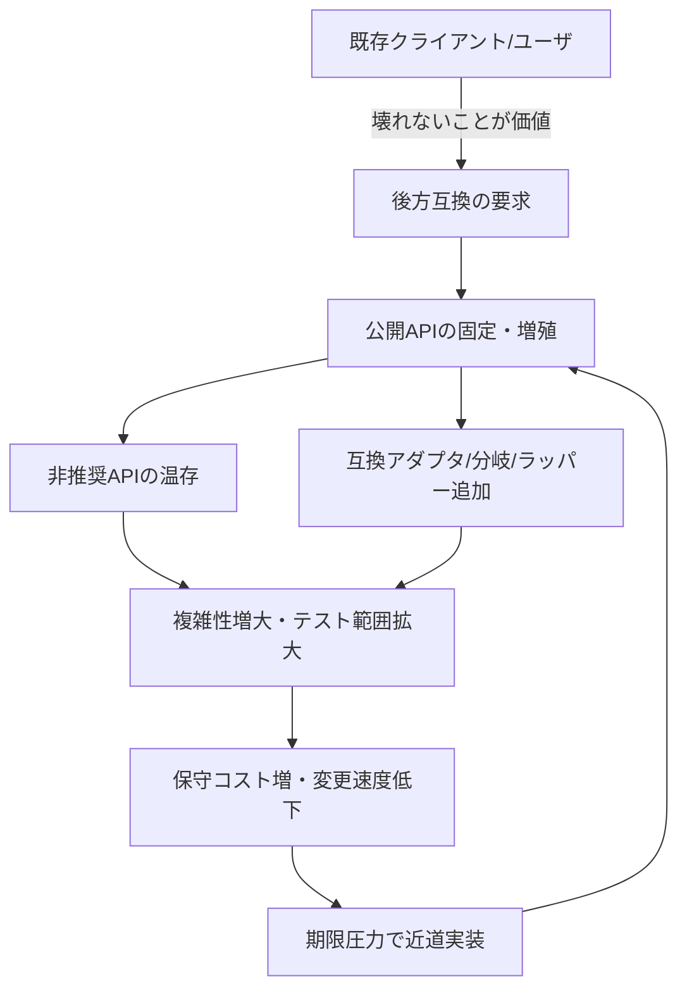
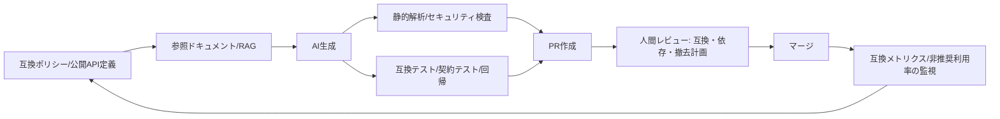

# 後方互換性がゴミコードを量産する構造と、実務での抑え込み戦略

## エグゼクティブサマリ

後方互換性（Backward Compatibility）は「新しい版へ更新しても、既存の利用者（クライアント／周辺コンポーネント）が壊れない」ことを価値として担保する約束であり、エコシステムの信頼・採用・更新容易性を支える一方で、設計・運用・組織がその“代償（互換維持コスト）”を明示的に管理しない場合、互換レイヤ・アダプタ・条件分岐・非推奨APIの温存が累積しやすく、保守性の低い「ゴミコード」へ構造的に誘導されます。citeturn7search0turn6search0turn0search1turn12search1

技術的には「公開APIの境界が曖昧」「非推奨化と削除の統治が弱い」「依存関係の破壊的変更が混入する」「テスト・ドキュメントが互換性保証の速度に追いつかない」などが、互換維持を“コードでの場当たり対応”へ変換します。API非推奨化は後方互換を保つために古いAPIを残し続ける必要があり、これがコード膨張やセキュリティ／性能／品質への脅威になり得ることが指摘されています。citeturn6search0turn6search5turn6search4turn2search0

組織的には、リリース方針（互換期間・削除タイムライン）を決めても、それを実行するための人・時間・計測（テレメトリ、利用率、撤去計画）が不足すると「残すしかない」が常態化します。実例として、ある言語は“非推奨期間は少なくとも2年”をポリシー化し、ある基盤は“Beta APIは一定期間で停止”を明文化し、別のOSは互換性修正（shim）で旧アプリを動かすなど、互換性を守るほど“互換層”が増える設計的現実が観測できます。citeturn0search1turn0search2turn1search38

定量面では、コードの複雑化・臭い（code smells）が変更容易性とバグ修正コストに結びつく研究や、互換性を破る変更が一定割合で発生しクライアントへ影響する大規模調査、テスト不備が経済損失を拡大させる推計などが存在します。たとえばコード臭のあるクラスは臭いのないクラスよりバグ修正数の中央値が大きい（例：9 vs 3）という結果が報告されています。citeturn2search10turn6search26turn6search16turn10view1

AI／エージェントが開発に混入すると「生成速度＞理解・検証速度」というギャップ（“verification debt”として言及される概念）が顕在化し、互換性に必要な“慎重さ”がさらに不足しがちです。AI生成コードの脆弱性混入、依存パッケージの幻覚（存在しない依存名）などは、互換維持の難度（検証範囲・依存統治）を引き上げ、放置すれば「互換＋AI起因」の複合的負債になります。citeturn5search0turn5search5turn3search4turn4search1

この報告は、原因→影響→対策の順に、後方互換が「なぜ」ゴミコード化を招くのかを分解し、実務での“互換性ガバナンス”として再設計する手がかりを提示します。citeturn6search0turn7search0turn12search8

小結：後方互換は「良いこと」だが、管理単位を誤ると“互換のためのコード”が主役化し、構造的にゴミコードを増やします。citeturn6search0turn12search1

## 背景と定義

後方互換性は、一般に「旧バージョン向けに書かれたクライアント／データ／拡張が、新バージョンでも（意図した範囲で）動作する」性質を指します。重要なのは、互換性が“すべて”ではなく「どの境界（public API、データ形式、ネットワーク契約、OS ABIなど）を、どの強さ（ソース／バイナリ／振る舞い）で保証するか」を合意して初めて運用可能な契約になる点です。citeturn7search0turn7search16turn7search8

互換性には複数の層があります。たとえばJavaの互換性は、ソース互換・バイナリ互換・振る舞い互換といった分類で扱われ、更新時の「何が壊れたか」を分解する枠組みになります。citeturn7search16turn7search1turn7search8  
同様に、仕様文書で“必須（MUST）”などの要求語を定義して、互換性ポリシーやバージョニング規約を規範化する例も一般的です。citeturn7search2turn7search17

後方互換性の利点は、更新を“個別に”進められることです。言語や基盤が「古いプログラムがそのまま動く」期待を提供すると、利用者は大規模な同時更新（big bang）を避け、アップデート採用の心理的コストとリスクを下げられます。citeturn1search8turn7search3turn8search25  
一方でトレードオフは、変更の自由度が下がることです。APIを削除しにくくなり、古い挙動を残すための分岐や互換層が追加され、結果的にコード膨張（code bloat）やセキュリティ・性能・品質のリスクが指摘されています。citeturn6search0turn1search38turn12search1

また、互換性は“環境が同時に更新されない”という現実（分散システム、モバイルの断片化、外部APIの顧客多様性）で強制されることが多いです。相手側を更新できない状況では、後方互換な更新クラス（変更の型）が一定割合で現れる、という実証研究もあります。citeturn6search14turn6search23

小結：後方互換性は「境界と強さを明文化した契約」であり、契約を守るコストをコード・運用・組織で分担できないと、負債としてコードベースへ沈殿します。citeturn7search0turn6search0turn7search16

## 原因

後方互換性がゴミコードを量産するのは、互換性要求が「設計上の制約」から「実装上の場当たりパッチ」へ変換される経路が複数存在し、それらが相互に増幅するためです。以下は、実務で頻出する原因を“技術的”と“組織的”に分け、ゴミコード化へ至るメカニズムとして整理したものです。citeturn6search0turn12search1turn2search31

### 原因一覧

| 区分 | 原因（要約） | 互換性要求がコード化される典型 | ゴミコードの典型症状 | 根拠例 |
|---|---|---|---|---|
| 技術 | 公開API境界が曖昧 | 内部都合の変更が“外部破壊”になり、ラッパーで延命 | 互換層の散在、重複実装、不要引数の増殖 | SemVerは“public APIを明確にせよ”と要求citeturn7search0 |
| 技術 | 非推奨化の運用不足 | 非推奨APIを残し続ける（削除できない） | “deprecatedだが使われ続ける”コードが恒久化 | 非推奨API維持がコード膨張等の脅威になり得るciteturn6search0 |
| 技術 | 依存関係の破壊的変更 | ピン留め・分岐・互換アダプタで吸収 | バージョン条件分岐、互換ハック | npm系で破壊的変更がminor/patchにも混入しうるciteturn6search5 |
| 技術 | テストが互換性を表現できない | “互換であるべき振る舞い”が検出不能 | リグレッションが暗黙化し、バグ互換に依存 | テスト不備の経済損失推計citeturn10view1 |
| 技術 | ドキュメント欠如 | 移行手順がなく“残すしかない” | 旧API温存、互換層が増える | 破壊的変更の文書化欠如（例：55%未記載）citeturn6search4 |
| 組織 | リリース方針が“撤去”を含まない | 互換維持が永久債務化 | 互換コードが積み上がる一方 | 互換ポリシーは“期間”を明示する必要citeturn0search1turn0search2 |
| 組織 | PMのインセンティブ | 新機能優先で互換撤去が後回し | “残骸”が増える | API非推奨化は提供側に継続コストciteturn6search0 |
| 組織 | レガシー維持文化 | 「壊さない」が最上位規範になり、改修が萎縮 | “コード品質より互換”の意思決定 | ユーザ空間I/Fは極めて安定で壊さない�citeturn8search28turn8search25 |
| 市場 | 断片化・更新遅延 | 古い環境を切れず互換層が必要 | 分岐・互換ライブラリ依存 | 断片化ゆえ旧新両方の互換維持が必要citeturn6search23turn1search3 |
| 横断 | AI生成の加速 | 生成速度＞検証速度で“レビュー漏れ” | “見た目は正しい”が整合しない変更 | AI利用の検証ギャップ（verification debt）citeturn5search0turn5search5 |

上表が示す通り、「互換性」と「ゴミコード」は直接同義ではありません。問題は、互換性要求が（本来は）プロダクト契約・仕様・テスト・移行ガイド・計測で吸収されるべきところ、これらが欠けると“実装のその場しのぎ”に落ち、結果として互換層が肥大化する点です。citeturn6search0turn7search0turn12search2

### 互換性が負債へ転化するフィードバックループ

このループは、技術的負債の“利息（interest）”が増える構造と整合します。短期の近道（仕様の明文化や互換テストを省く等）は短期価値を生みますが、将来の変更で追加コストが発生する、という見方は技術的負債の整理で一般的です。citeturn2search31turn2search3turn2search27

小結：後方互換それ自体が悪ではなく、互換性を支える“仕様・テスト・撤去計画・計測”が欠けたとき、互換要求が実装へ流れ込みゴミコード化します。citeturn6search0turn7search0turn10view1

## 具体事例

ここでは、オープンソースと商用プロジェクトから6件を選び、「互換性を守るほど互換層が増える」設計・運用上の実像を示します。引用は短い原文を添え、参照リンクは出典（citation）として提供します。citeturn1search8turn0search1turn0search2turn8search28turn1search38turn7search3

### 事例サマリ表

| 対象 | 互換性コミットの例 | “互換のためのコード”が増えるポイント | 代表的な抑え込み策（そのプロジェクトが採る／採り得る） |
|---|---|---|---|
| entity["organization","Go","programming language"] | Go 1仕様の互換性意図を明文化 | 互換破壊を避ける設計制約が標準ライブラリ・ツールチェーンに波及 | 互換性意図の明文化、移行設計（将来の移行提案）citeturn1search8turn1search0turn1search36 |
| entity["organization","Python","programming language"] | 互換破壊は非推奨プロセス経由、期間も規定 | 非推奨APIの保持期間がコード温存を制度化 | デプリケーション政策の明文化、soft deprecation等の分類citeturn0search1turn0search9turn0search5 |
| entity["organization","Kubernetes","container orchestration project"] | APIの段階（GA/Beta/Alpha）ごとに撤去規則 | 複数APIバージョン併存・移行ガイド整備が継続コスト化 | デプリケーションポリシー＋移行ガイド＋検出ツールciteturn0search2turn0search14turn0search18 |
| entity["organization","Linux kernel","operating system kernel"] | ユーザ空間ABIは極力壊さないが内部APIは流動的 | “壊さない境界”の定義が厳格なほど互換制約が強い | 安定境界の明示（ユーザ空間vs内部）、内部APIは進化可能citeturn8search28turn8search25turn1search5 |
| entity["company","Microsoft","software company"] | 互換性修正（shim）で旧アプリ互換を維持 | 互換レイヤがOS側に蓄積し、複雑性と攻撃面が増える | 互換DB・shimの管理、移行支援。ただし“互換層自体”が資産兼負債citeturn1search2turn1search38turn1search18 |
| entity["company","Stripe","payments company"] | 月次リリースは後方互換のみ・API版指定で段階移行 | APIバージョン共存・SDK型付け制約が運用設計へ影響 | 版指定・アップグレード手順・言語別制約の明文化citeturn7search3turn7search18turn7search6 |

### 各事例の示唆を補強する短い引用

> “programs written to the Go 1 specification will continue to compile and run correctly, unchanged”  
出典: citeturn1search8

> “deprecation period must last at least two years”  
出典: citeturn0search1

> “Beta API versions… no longer served 9 months or 3 minor releases after deprecation”  
出典: citeturn0search2

> “The kernel to userspace interface… is very stable over time, and will not break.”  
出典: citeturn8search28

> “a compatibility fix… is a small piece of code that intercepts API calls”  
出典: citeturn1search38

> “Each monthly release includes only backward-compatible changes”  
出典: citeturn7search3

これらの事例は、互換性が“理念”ではなく“制度（ポリシー）＋実装（互換層）＋運用（移行・計測）”で成立していることを示します。互換層は、うまく隔離できれば安定性の基盤（資産）ですが、隔離に失敗すると、機能追加・改修のたびに分岐が散って“ゴミ化”します。citeturn6search0turn12search3turn1search38

加えて、互換性を守る“境界”を明確にすると、逆に境界外（内部API）を大胆に変えられる余地も生まれます。カーネル文書は「ユーザ空間へのバイナリI/Fは原則壊せないが、内部I/Fは流動的」と明言しており、これは「互換の範囲を限定する」戦略の典型です。citeturn8search25turn1search5  
また、互換層はセキュリティ上の攻撃面になり得ることも実務上重要です（shimの悪用に関する研究・事例が存在）。citeturn1search18turn1search30

小結：成功しているプロジェクトほど、互換性を“明文化された境界と期間”に落とし込み、互換層を隔離・管理する一方、その管理コスト自体が恒常的に発生します。citeturn0search2turn0search1turn8search25turn1search38

## 定量的影響

「ゴミコード化」は主観語に見えますが、研究・産業データでは、互換維持に伴う複雑性・負債・非推奨API温存が、欠陥・変更容易性・コストへ結びつく観測が示されています。ここでは、互換維持が生む“技術的負債（principal/interest）”、欠陥率／変更影響、保守コストの観点で代表的データをまとめます。citeturn2search3turn6search0turn6search26turn10view1

### 互換性・API破壊・ドキュメント不備の頻度

APIの破壊的変更（後方互換性を壊す変更）は、実際のエコシステムで一定割合発生します。Javaライブラリの大規模調査では、API変更のうち互換性を破るものが中央値で約14.78%で、一定割合のクライアントが影響を受ける、という結果が提示されています。citeturn6search26turn6search18  
また、別研究では、リリースの約3分の1が少なくとも1つの破壊的変更を含む、破壊的変更はクライアント側の手戻りに有意な影響を持つ、と報告されています。citeturn6search16turn6search9  
実務上の悪化要因として、破壊的変更が“適切にドキュメント化されない”問題も確認されています。たとえばあるエコシステム調査では、リリースの28%が後方互換でなく、その破壊的変更の55%がドキュメントに記載されていなかった、と報告されています。citeturn6search4

この状況は「互換性を壊すな」という規範だけでは防げず、バージョニング規約（SemVer等）と実際が乖離すること、依存管理の指定（例：範囲指定）で破壊的変更が“混入して顕在化する”ことを示します。npm依存関係の“manifesting breaking changes”研究では、破壊的変更がminor/patchに混入する例が示され、依存側がダウングレード等で回復するパターンも観測されています。citeturn6search5turn7search0

### コード品質劣化と欠陥・保守コスト

コードの複雑性・臭い（code smells）は、変更容易性や欠陥との関係が繰り返し研究されています。たとえば、code smellsに影響を受けたクラスは、臭いのないクラスよりバグ修正数の中央値が大きい（例：中央値9 vs 3）と報告されています。citeturn2search10  
互換維持のための分岐・重複・延命は、この“臭い”の温床になりやすく、結果として fault-proneness / change-proneness を高める、という位置づけが可能です（複数研究がコード臭と欠陥・変更傾向の関係を議論）。citeturn2search6turn2search10

また、ソフトウェアの複雑性が保守コストに寄与することを定量的に扱う古典研究もあり、複雑性や構造的要因が保守コストの一定割合を説明しうる、という方向性が提示されています。citeturn2search29  
保守フェーズがライフサイクルコストの大部分を占める、という推計・レビューも複数存在し（推計値自体には幅がある）、互換層の累積が中長期の費用構造へ効いてくること自体は、実務上の前提として扱われがちです。citeturn2search9turn2search5

### テスト不備の経済損失

互換性を守るには回帰（regression）を検出するテスト基盤が必要ですが、テスト不備の社会的コストを推計したNIST報告では、テスト基盤不備による米国経済への年間コストが約595億ドル、改善可能性が約222億ドルと見積もられています。citeturn10view1turn9view0  
同報告の別表では金融サービス分野のケースでのコスト影響も示され、重大・軽微バグの発生とそれに伴う損失・回避活動コストの存在が整理されています。citeturn10view0

互換性を守る“範囲”が広いほどテスト範囲も広がるため、テスト投資が追いつかないと、互換を守るために残したコードが逆に不具合発生源となり、さらに互換ハックが増える、という負の循環に入ります。citeturn10view1turn6search0turn2search27

### AI混入時の追加的な定量観測

AI支援コーディングは、生成量の増加に対して検証が追いつかない問題が指摘されています。ある開発者調査では、コミットコードのうちAI生成／支援が42%と報告され、AIコードを完全には信頼しない回答が96%ある一方で、常に検証するのは48%というギャップが示されています。citeturn5search5turn5search0  
また、オープンソースPR分析では、AI関与PRが人間のみPRより問題（issues）が約1.7倍多いとする報告があります（分析方法・限界は明示されている）。citeturn4search2turn4search6turn4search10  
セキュリティ面では、AIが安全でないコードを提案しうること、コード生成モデルが脆弱性を含む出力を生む傾向があることが研究・レビューで議論されています。citeturn3search4turn3search19turn3search7  
さらに供給網リスクとして、コード生成LLMが存在しない依存パッケージ名を提案する“package hallucination”を大規模に測定し、商用モデルでも一定割合が発生しうることを示す研究があります。citeturn4search1turn4search5

小結：互換性を守るほど、（i）破壊的変更の回避・吸収コスト、（ii）複雑性と欠陥、（iii）テスト・ドキュメント不備の損失が複合し、保守コストと品質リスクが統計的に増えやすい土壌が形成されます。citeturn6search0turn2search10turn10view1turn5search5turn4search1

## 対策とベストプラクティス

対策の要点は「互換性を“残すコード”ではなく“契約と撤去計画”として管理する」ことです。互換性維持はプロダクト価値である一方、放置すれば負債化するため、設計・テスト・ドキュメント・ガバナンスを一体のシステムとして組む必要があります。citeturn6search0turn7search0turn2search3

### 設計とAPI運用

まず、公開APIの境界を明確化します。SemVerは、SemVerを名乗るなら“public APIを宣言し、正確で包括的であるべき”という要求を置いています。citeturn7search0  
ライブラリ作者向けガイドラインでも、互換を壊す削除ではなく、deprecation cycle（非推奨→移行猶予→削除）を推奨し、ユーザに移行時間を与えるべきだと述べています。citeturn6search19

次に、非推奨化を「手続き」に落とします。後方互換ポリシー例では、非推奨期間の下限（例：2年）や、連続リリース間で互換破壊を起こさない原則が明文化されています。citeturn0search1  
別の大規模基盤では、API段階（GA/Beta/Alpha）ごとに撤去可能性・タイムラインを規定し、移行ガイドを提供します。citeturn0search2turn0search14  
商用APIでは、APIバージョン（例：日付版）をヘッダ等で明示し、互換な変更のみを“月次リリース”として束ねる方式が採用されています。citeturn7search3turn7search18

### 変更を局所化するパターン

互換対応を“コードベースのあちこちに散らさない”ことが、ゴミコード化の主戦場です。互換性吸収のためにはアダプタ（Adapter/Wrapper）を使い、「非互換なI/F同士が協調できるようにする」ことで分岐を一点に押し込められます。citeturn12search3  
レガシー置換ではストラングラーフィグ（Strangler Fig）パターンが、全面リライトのリスクを下げつつ段階移行する戦略として整理されています（日本語の規範ガイダンスも存在）。citeturn12search0turn12search8

ただし、フィーチャーフラグ（Feature Toggles / Feature Flags）は互換性と同様に「複雑性を持ち込む」ため、分類・寿命・撤去を管理しないと新たな負債になります。citeturn12search1turn12search9

### テスト・CI・互換性検証

互換性を守るには「互換であることを自動で検証できる」必要があります。APIの互換性は利用者ごとの“使い方”に依存するため、consumer-driven contract testing（CDC）は「消費者が使う部分だけを契約として固定し、使われない挙動は自由に変えられる」狙いを明示しています。citeturn12search2turn12search10  
互換性を守る範囲が広いほど回帰の検出が重要になり、テスト不備が大きな経済損失を生むという推計もあるため、互換性を“テストで保持”する投資は合理化しやすい領域です。citeturn10view1

実務では、CIで最低限以下をゲート化するのが定石です（個別技術は環境依存のため抽象化します）：

- 互換性の対象（public API、データフォーマット、契約）ごとの回帰テスト（ゴールデンテスト、契約テスト等）citeturn12search2turn7search0  
- 非推奨API利用の検出と、移行の進捗可視化（例：非推奨APIの検出ツール運用）citeturn0search18turn0search10  
- 破壊的変更の検出（静的解析・差分解析）と、リリースノート／移行ガイドへの反映（“未記載が多い”という研究上の課題への対策）citeturn6search4turn6search0  

### ガバナンスと意思決定

非推奨APIを残すことは、提供者に継続コストを発生させ、管理が悪いと無駄なコストだけが残る、という指摘があります。citeturn6search0  
したがって、互換性を“意思決定”として扱うために、最低限次を制度化します。

- 互換性のスコープ（何を壊さないか）と例外条件（セキュリティ等）を文書化するciteturn1search8turn1search4turn8search25  
- 非推奨→削除のSLO（例：最低猶予期間、削除のメジャー条件）を定めるciteturn0search1turn0search2  
- 利用率計測（テレメトリ）に基づく撤去判断（“誰が使っているか不明”を減らす）citeturn6search29turn6search0  
- “互換性予算（compatibility budget）”として、互換維持に費やす工数・複雑性上限を見積り、超過時はバージョニングや移行投資へ切り替える（負債のprincipal/interest概念で説明可能）citeturn2search3turn2search27  

### 対策比較表

| 対策 | 効く主因 | 主な利点 | 主なコスト／落とし穴 | 向く状況 |
|---|---|---|---|---|
| 公開API境界の明確化（仕様化） | API境界曖昧 | 互換対象を限定でき、不要な互換コードを防ぐ | “仕様を書く”初期コスト | ライブラリ／SDK／プラットフォームciteturn7search0 |
| deprecation cycle＋撤去SLO | 非推奨温存 | 撤去が制度化され、コード墓場を減らす | 実行のための人員・期間が必要 | 長期運用プロダクトciteturn0search1turn6search19 |
| APIバージョニング（SemVer／日付版等） | 顧客多様性 | 段階移行が可能 | バージョン共存コスト（仕様・テストが増える） | 公開API／外部顧客が多いciteturn7search0turn7search18turn7search3 |
| アダプタ／互換レイヤの集中管理 | 分岐散在 | 互換処理を局所化し、ゴミ化を抑える | “互換ハブ”が肥大化する危険 | 大規模移行・I/F変換citeturn12search3 |
| Strangler Fig（段階置換） | レガシー刷新 | リスク低減・段階的価値提供 | 移行期間中は二重運用 | レガシー刷新／段階モダナイズciteturn12search8turn12search4 |
| 契約テスト（CDC） | “利用者の使い方”不明 | 使われる範囲だけ固定し、自由度を確保 | 消費者側テスト整備が必要 | マイクロサービス/外部APIciteturn12search2turn12search10 |
| 互換性テレメトリ＋撤去判定 | 使用状況不明 | 撤去の意思決定が可能 | 計測・プライバシー配慮 | 大規模プロダクトciteturn6search29 |

小結：互換性は「設計・テスト・運用・撤去」の総合問題であり、互換層を局所化し、撤去可能性を制度化するほどゴミコード化を抑えられます。citeturn6search0turn7search0turn12search8turn12search2

## AI・エージェント時代の特有の問題と対策

AI（Codex/Claude等）やエージェントが開発に関与すると、互換性問題は「生成量の爆発」と「検証能力のボトルネック」によって増幅されます。これは従来の技術的負債に加えて、検証不足が蓄積する“verification debt”として言及される現象とも整合します。citeturn5search0turn5search5turn3search1

### 特有の問題

第一に、モデルは公開コードから学習しうるため、古い慣習・非推奨API利用・安全でない実装を“それらしく”再生産します。Codexに関する原著論文は、GitHub上の公開コードで微調整されたモデルであり、機能正しさ評価（HumanEval）や適用の文脈を示していますが、学習データが“未検証コードを含む”ことへの懸念がセキュリティ研究で議論されています。citeturn3search1turn3search4

第二に、AI生成コードは脆弱性を含みうることが複数研究・レビューで指摘されています（Copilot提案の安全性評価や、生成コードの脆弱性傾向をまとめた政策研究など）。citeturn3search4turn3search19turn3search7  
互換性維持では“古い挙動”や“広い入力空間”を扱うため、セキュリティ欠陥が混入すると影響範囲が大きくなりがちです。citeturn6search0turn1search38turn1search18

第三に、供給網リスクとして、LLMが存在しない依存パッケージ名を生成する“package hallucination”が大規模測定で示されており、商用モデルでも一定割合の幻覚が出ると報告されています。これは互換性以前に「依存関係の正当性（存在・安全性）」検証を必須化する圧力になります。citeturn4search1turn4search21

第四に、AI利用の実態として「AIコードを信頼していないが、常に検証していない」ギャップが調査で示され、生成速度と検証速度の不均衡が制度問題化しています。citeturn5search5turn5search0  
さらにPR分析ではAI関与PRで問題発見数が増えるとされ、レビュー負荷が上がる可能性が示唆されています。citeturn4search2turn4search30

### AI関与時の対策

原則は「AI出力を“未信頼入力”として扱い、互換性・依存性・安全性をゲートで縛る」です。実務的には次が中核になります。

- **互換性をテストで縛る**：AIにコードを書かせるほど、契約テスト／回帰テストの価値が上がります。CDCは“使われる部分だけ固定できる”ため、互換性のスコープ管理にも相性が良いです。citeturn12search2turn12search10  
- **依存関係の検証（allowlist／存在確認）**：package hallucination研究は、幻覚低減の手法（生成前後の検証等）を提示しており、依存検証ゲートの根拠になります。citeturn4search1turn4search5  
- **AIにテスト生成・自己修正ループを組み込む**：Androidの非推奨API更新をLLMで行い、テスト生成→誤り検出→反復修正で品質を上げる研究（GUPPY）は、“AIが関与してもテストで締める”方向性の具体例です。citeturn6search6  
- **“検証負債”を計測・可視化する**：AI利用に伴う検証ギャップの存在が調査で示されているため、組織としては「AI関与PRの追加レビュー項目」「互換性チェックリスト」「自動解析の必須化」を制度に落とすのが現実的です。citeturn5search0turn4search2  

### AI関与の開発フロー例（ゲート設計）

小結：AI時代は「互換性のために残したコード」が増えるだけでなく、「検証不足そのもの」が負債化しやすいので、互換性とAIを同時に“テストとガバナンスで縛る”設計が必須です。citeturn5search0turn4search1turn12search2turn6search6